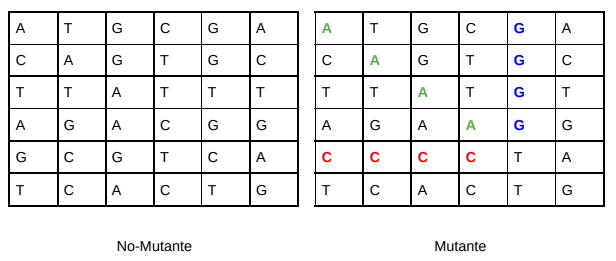

# Mutation detection app

This is an exercise api made in order to find a "mutation" on  a sequence DNA sequence. The main algorithm consists of a function that receives an array of strings (NxN) and returns 'true' if more than 1 sequence of 4 contiguous nitrogen bases (A, C, T, G) can be found in any direction.

**Example:** \
\

## Examples: curl
The base url of the api is https://api.francisco-calixto.com/mutation-app .

**Standard error response:**

   

    { 
	    "error": {
			    "code": 4XX,
			    "message": "X"
	    }
    }

**Standard success response:**

    { 
	    "data": {
			    ...
	    }
    }

## **POST  /mutant**

**Example Request**

    curl -XPOST https://api.francisco-calixto.com/mutation-app/mutant \
    -H 'Content-Type:application/json' \
    -d '{"dna":["ATGCGA","CAGTGC","TTATGT","AGAAGG","CCCCTA","TCACTG"]}'

**Example Response**

    { 
	    "data": {
			    "code": 200,
				"message": "mutation detected"
	    }
    }

## **GET /stats**

**Example Request**

    curl https://api.francisco-calixto.com/mutation-app/stats
   

**Example Response**

    { 
	    "data": {
			    "count_mutant_dna": 8,
				"count_human_dna": 10,
				"ratio": 0.8
	    }
    }
